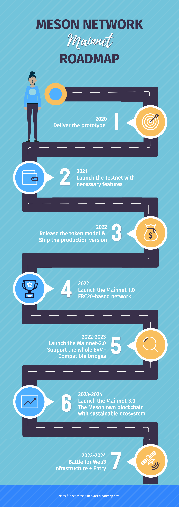

# Roadmap

<el-timeline style="margin-top: 35px;">
    <el-timeline-item timestamp="2020" placement="top" :hollow="false" type="success">
        <el-card>
            <h4>Deliver the Meson prototype</h4>
        </el-card>
    </el-timeline-item>
    <el-timeline-item timestamp="2021" placement="top" :hollow="false" type="success">
        <el-card>
            <h4>Launch the Testnet-1.0 with necessary features</h4>
        </el-card>
        <el-card>
            <h4>Launch the Testnet-2.5</h4>
            
several 

        </el-card>
    </el-timeline-item>
    <el-timeline-item timestamp="2022" placement="top" :hollow="true" type="primary">
        <el-card>
            <h4>Release the token model</h4>
            
We will design the token incentives and corresponding mechanisms for participants in the system.

        </el-card>
        <el-card>
            <h4>Ship the production version</h4>
        </el-card>
    </el-timeline-item>
    <el-timeline-item timestamp="2022" placement="top" :hollow="true" type="primary">
        <el-card>
            <h4>Mainnet-1.0: ERC20-based network</h4>
            
We expect to launch the first mainnet version of Meson Network on Ethereum. Users can start trading bandwidth resources on Meson upon our launch.

        </el-card>
    </el-timeline-item>
    <el-timeline-item timestamp="2022-2023" placement="top" :hollow="true" type="primary">
        <el-card>
            <h4>Mainnet-2.0: Support the whole EVM-Compatible bridges</h4>
            
We will support various EVM-compatible chains, lower the threshold for users to use the network, and begin to integrate decentralized home nodes as a complement to the network.

        </el-card>
    </el-timeline-item>
    <el-timeline-item timestamp="2023-2024" placement="top" :hollow="true" type="primary">
        <el-card>
            <h4>Mainnet-3.0: Meson Blockchain</h4>
            
We will launch the Meson blockchain with sustainable ecosystem

        </el-card>
        <el-card>
            <h4>Battle for Web3: Infrastructure & Entry</h4>
        </el-card>
    </el-timeline-item>
</el-timeline>

---

